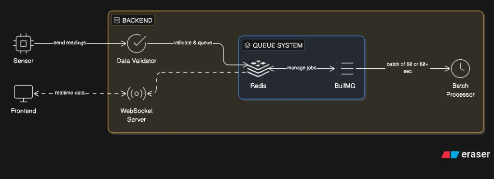

# 🏗️ Unbox Robotics - Fleet Speedometer Architecture

## Architecture diagrams (current)

High-level view of **containers, protocols, and data** as implemented in `docker-compose.yml`. The dashboard uses **WebSocket** for live speed; **HTTP POST** is for sensor ingest; **Postgres** is fed by the **worker** via batched writes, not by the public speed read APIs.

### Notes

- **Frontend** history and charts are built from **live WebSocket** samples in the browser.
- **Same backend image** runs **API** (`npm start`) and **worker** (`npm run worker`) with shared `./backend` code and a Compose volume **`backend_node_modules`** for `node_modules`.

---

## System Architecture Diagram

High-level layout: sensor readings → validation → queue (Redis + BullMQ) → **WebSocket** to the UI; worker flushes batches (~60 rows or timeout) to **Postgres**.


<p align="center">
  
</p>

**Code note:** Live `speed:update` events are emitted from the **Express** ingest route when a POST is handled. Redis is the **BullMQ** broker; it does not push directly to Socket.IO.

---

## 🎯 Current Configuration

### **Active Sensor**

- **Sensor ID:** `sensor-1`
- **Update Interval:** 1 second
- **Speed Range:** 0-120 km/h
- **Data Sent:** id, sensorId, speed, timestamp

### **Frontend Focus**

- **Selected Sensor:** `sensor-1` (constant in `frontend/src/App.jsx`)
- **Speedometer Display:** Shows sensor-1 speed in real-time
- **Live Readings:** Displays sensor-1 updates with timestamps
- **Trajectory Chart:** Session **in-memory** history from WebSocket `speed:update` (capped, e.g. ~8000 points; last ~30 minutes bucketed in the chart — **not** loaded from Postgres or a GET API)

### **Database**

- **Table:** SpeedLog (stores all sensor data)
- **Current Data:** All sensor-1 records
- **Schema:** Supports multiple sensors (sensorId is a column)
- **Unique Constraint:** (sensorId, timestamp)

---

## 🔄 Data Flow

### **1. Sensor-1 Data Collection (Every 1 sec)**

```
Speed Simulator (sensor-1)
    ↓ [Every 1 second]
Generate speed: 0-120 km/h (realistic motion)
    ↓
Create record: {id, sensorId: "sensor-1", speed, timestamp}
    ↓
HTTP POST → /api/speed
    ↓
Backend API receives
```

### **2. Real-time Frontend Update**

```
Backend API
    ├─ Validate data ✅
    ├─ Broadcast WebSocket event "speed:update"
    │  └─→ React App receives instantly
    │     └─→ Speedometer updates live
    │     └─→ Live readings panel updates
    │     └─→ Event log records change
    │
    └─ Queue job for async processing
       ↓
Redis Queue (BullMQ)
       ↓
Worker Service
       ├─ Buffer record in memory
       └─ When 60 records accumulated OR 60 sec timeout
          ↓
Database INSERT (all 60 at once)
          └─→ Persistent storage ✅
```

### **3. Sensor Offline Detection**

```
No update from sensor-1 for 10 seconds
    ↓
Sensor Status Checker (2-sec periodic check)
    ├─ Detects timeout
    ├─ Emits WebSocket "sensor:status" event
    │  └─ Event: {sensorId: "sensor-1", status: "offline"}
    └─→ Frontend shows "⚠️ SENSOR OFFLINE"
```

---

## 🐳 Docker Services

```
Docker Compose (6 services)

├─ speedometer-db         (PostgreSQL 15)
│  └─ Port 5432
│  └─ Stores: All sensor data (including sensor-1)
│
├─ speedometer-redis      (Redis 7)
│  └─ Port 6379
│  └─ Queue: BullMQ jobs
│  └─ Persistence: AOF (Append-Only File)
│
├─ speedometer-api        (Express Backend)
│  └─ Port 4000
│  └─ Routes: /api/speed endpoints
│  └─ WebSocket: Real-time broadcasts
│
├─ speedometer-worker     (Node.js Worker)
│  └─ Internal port
│  └─ Process: Batch insert (60-record flush)
│  └─ Buffer: Records waiting for database
│
├─ speedometer-ui         (React Frontend)
│  └─ Port 3000
│  └─ Display: Speedometer (sensor-1)
│  └─ WebSocket: Receives real-time updates
│
└─ speedometer-sensors    (Sensor Simulator)
   └─ Internal port
   └─ Sends: sensor-1 speed data (1/sec)
   └─ Target: Backend API
```

---

## 💾 Batch Writing Optimization

### **Example: Single Sensor (sensor-1)**

```
Timeline:
  t=0s    : sensor-1 sends first speed (1.5 km/h)
  t=1s    : sensor-1 sends speed (2.3 km/h)
  t=2s    : sensor-1 sends speed (3.1 km/h)
  ...
  t=59s   : sensor-1 sends speed (45.2 km/h) [Record 59]
  t=60s   : sensor-1 sends speed (46.1 km/h) [Record 60]
           → BATCH FLUSH TRIGGERED
           → INSERT 60 records in ONE query
           → All 60 records written to database ✅
           
  t=61s   : sensor-1 sends speed (47.3 km/h) [Record 1 of next batch]
  ...
  t=120s  : [Record 60 of 2nd batch]
           → BATCH FLUSH TRIGGERED
           → INSERT 60 records in ONE query ✅
```

### **Timeout Flush Example**

```
Scenario: sensor-1 stops after 35 records

  t=0s-34s   : 35 records in buffer
  t=35s      : sensor-1 stops sending
  t=95s      : 60-second timeout reached
             → Flush remaining 35 records
             → INSERT 35 records to database ✅
```

---

## 🔐 Data Safety

### **✅ Graceful Shutdown**

```
System shutdown command (SIGINT/SIGTERM)
    ↓
Worker catches signal
    ↓
Clear timeout
    ↓
Flush any buffered records (< 60)
    ↓
Write all buffered records to database
    ↓
Clean exit (no data loss) ✅
```

### **✅ Queue Persistence**

```
Redis AOF enabled
    ↓
All BullMQ jobs logged to disk
    ↓
If process crashes:
    - Jobs survive in Redis
    - On restart, worker reprocesses jobs
    ↓
Data integrity maintained
```

### **✅ Duplicate Prevention**

```
Unique Constraint: (sensorId, timestamp)
    ↓
If same speed at same timestamp arrives twice:
    - Database rejects duplicate
    - Returns error
    - Frontend handles gracefully
    ↓
Data consistency guaranteed ✅
```

---

## 📊 Performance Metrics

### **Single Sensor (sensor-1)**


| Operation                   | Time         | Details                                                                             |
| --------------------------- | ------------ | ----------------------------------------------------------------------------------- |
| **Speed Update**            | <1ms         | WebSocket broadcast (ingest path; not a DB operation)                               |
| **Database write path**     | —            | **Worker only:** in-memory buffer → **bulk** INSERT (no single-row insert API/path) |
| **Batch INSERT** (~60 rows) | ~5–50ms typ. | One `bulkInsertSpeedLogs` flush when buffer reaches 60 records or 60s timeout fires |


---

## 🚀 Tech Stack


| Layer              | Technology                      | Purpose                                     |
| ------------------ | ------------------------------- | ------------------------------------------- |
| **Frontend**       | React, Vite, Tailwind, Recharts | Dashboard UI, charts, Socket.IO client      |
| **API**            | Express, **Socket.IO**          | `POST /api/speed` ingest + real-time events |
| **Queue**          | BullMQ, Redis 7                 | Decouple ingest from DB writes              |
| **Worker**         | Node.js (same stack as API)     | Buffered **bulk** insert to Postgres        |
| **Database**       | PostgreSQL 15                   | `"SpeedLog"` persistence                    |
| **Infrastructure** | Docker Compose                  | Postgres, Redis, API, worker, UI, sensors   |
| **Error Handling** | Express middleware (`AppError`) | Centralized HTTP error responses            |
| **Simulators**     | Node.js, axios                  | POST sample telemetry to the API            |


---

