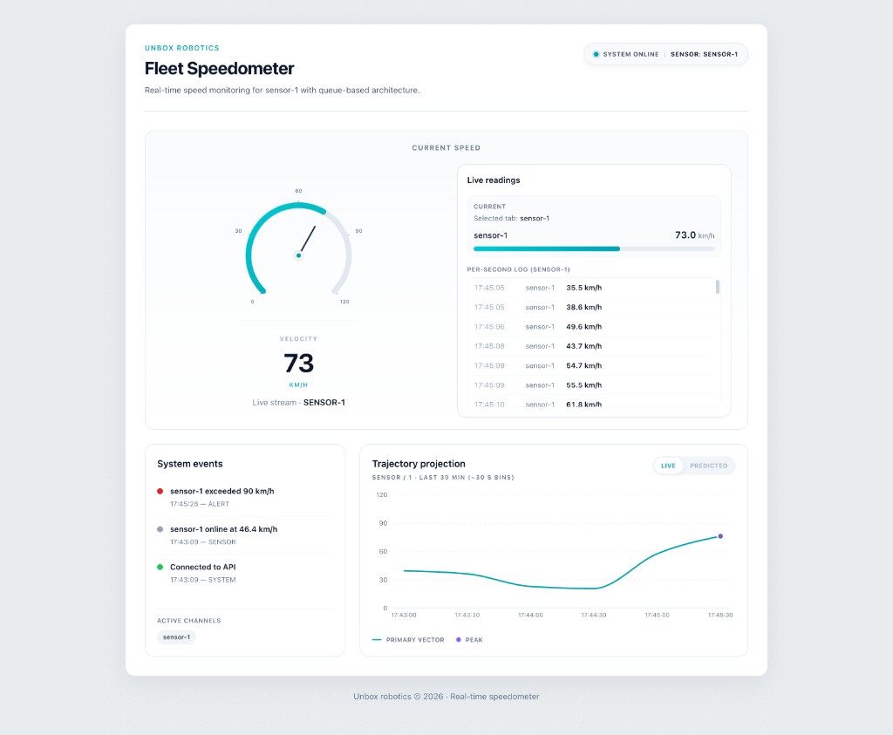

# 🚗 Unbox Robotics - Speedometer Full Stack Application

A real-time speedometer system that ingests continuous sensor data, processes it asynchronously, and displays live updates via a React frontend.

## Prerequisites

- Node.js 22+
- Docker & Docker Compose

## 📋 Project Structure

```
unBox-assignment/
├── backend/                   # Express API + BullMQ worker
│   ├── src/
│   │   ├── api/               # HTTP routes (e.g. speed ingest)
│   │   ├── db/                # PostgreSQL pool + init + bulk insert
│   │   ├── queue/             # BullMQ queue + worker factory
│   │   ├── workers/           # speedWorker (batch DB writes)
│   │   ├── utils/             # e.g. sensor heartbeat / offline detection
│   │   ├── middleware/        # errors, validation helpers
│   │   └── index.js           # HTTP + Socket.IO server entry
│   ├── package.json
│   ├── Dockerfile
│   └── .env.example
│
├── frontend/                  # React + Vite UI
│   ├── public/                # Static assets (e.g. favicon.svg)
│   ├── src/
│   │   ├── components/        # Header, Speedometer, SensorReadingsPanel, SystemEvents, TrajectoryChart
│   │   ├── hooks/             # useWebSocket
│   │   ├── App.jsx
│   │   ├── main.jsx
│   │   └── index.css          # Global styles (Tailwind entry)
│   ├── package.json
│   ├── vite.config.js
│   ├── Dockerfile
│   └── index.html
│
├── sensors/                   # Speed simulators
│   ├── src/
│   │   └── simulator.js       # POSTs fake sensor data to the API
│   ├── package.json
│   ├── Dockerfile
│   └── .env.example
│
├── docker-compose.yml         # Full stack (Postgres, Redis, backend, worker, frontend, sensors)
├── ARCHITECTURE.md
├── DOCKER.md                  # Docker-focused ops notes
└── README.md
```

---

## 🎯 Quick Start with Docker Compose

### 1. Clone / open the repo

```bash
cd unbox-robotics-assignment
```

Service configuration is set in **`docker-compose.yml`** via the `environment` block on each app service (no host `.env` files required).

### 2. Start all services

```bash
docker compose up --build
```

Use `docker-compose up --build` if you still use Compose V1 (`docker-compose` binary).

### 3. Access the application

- **Frontend**: [http://localhost:3000](http://localhost:3000)
- **API**: [http://localhost:4000](http://localhost:4000)
- **Database**: localhost:5432 (postgres/postgres)
- **Redis**: localhost:6379

---

## 📸 UI preview

Fleet Speedometer dashboard: header status, live gauge and readings, **sensor-1** event stream, and trajectory projection (with live / predicted toggle).



---

## 🏗️ Architecture

See [ARCHITECTURE.md](./ARCHITECTURE.md) for detailed system design.

## 📊 Key Features

✅ Real-time sensor data ingestion  
✅ Queue-based async processing  
✅ Live speedometer display  
✅ Historical data persistence  

## 🛠️ Tech Stack

- **Backend**: Express.js, BullMQ, Socket.io
- **Queue**: Redis
- **Database**: PostgreSQL
- **Frontend**: React
- **Container**: Docker + Docker Compose

